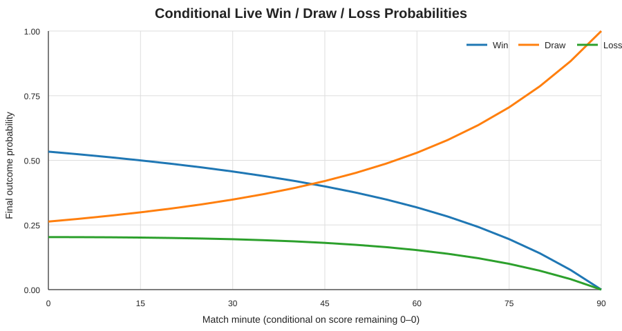

# Live Soccer Win Probability Forecasting

A stochastic modeling project for estimating **real-time win / draw / loss probabilities** in soccer. The project combines Poisson goal processes, continuous-time Markov chains, maximum-likelihood estimation, the Skellam distribution, time-varying intensities, Monte Carlo simulation, and event-level xG data.

<p align="center">
  
</p>

## Why this project

Soccer is unusually difficult to model live: goals are rare, draws are common, and a single event can sharply change the match state. This project builds the model from first principles, starting with an interpretable stochastic baseline and then extending it toward event-aware forecasting.

## Modeling stack

- **Poisson processes** model each team's goal arrivals.
- **Maximum-likelihood estimation (MLE)** estimates scoring intensities from historical matches.
- **Continuous-time Markov chains (CTMCs)** model the score differential as a birth-death process.
- **Kolmogorov forward equations** evolve the full score-difference distribution through time.
- **Forward Euler integration** provides a numerical solver for the CTMC dynamics.
- **Skellam distributions** provide an exact reference distribution for the difference of independent Poisson counts.
- **Non-homogeneous Poisson processes** allow scoring intensity to vary over match time.
- **Gaussian kernel smoothing** estimates smooth time-dependent scoring intensities.
- **Monte Carlo simulation** converts minute-level scoring probabilities into live match-outcome probabilities.
- **StatsBomb xG/event data** supports event-aware extensions using shot quality, goals, red cards, substitutions, and match state.

## Baseline result

The original case study calibrates a Corinthians Série A baseline from **372 historical league matches**. The MLE scoring rates are approximately:

| Context | Team goals / 90 | Opponent goals / 90 |
|---|---:|---:|
| Home | 1.49 | 0.81 |
| Away | 0.98 | 1.15 |

For a representative home match starting 0–0, the Poisson/Markov model gives at kickoff:

| Outcome | Probability |
|---|---:|
| Win | **53.4%** |
| Draw | **26.3%** |
| Loss | **20.3%** |

The numerical CTMC solution agrees with the closed-form Skellam benchmark, providing a useful correctness check on the implementation. The figure above shows **conditional final probabilities if the score remains 0–0 as time elapses**; it is not an observed-match trajectory.

## Repository structure

```text
.
├── README.md
├── pyproject.toml
├── requirements.txt
├── src/
│   └── soccer_winprob.py      # reusable stochastic-modeling utilities
├── tests/
│   └── test_models.py         # numerical and probability-invariant tests
├── notebooks/
│   └── live_win_probability.ipynb
├── figures/
│   ├── home_wdl_curve.png
│   └── score_diff_distribution.png
└── data/
    └── README.md              # data sources and reproducibility notes
```

## Quick start

```bash
git clone https://github.com/JosefKorich/live-soccer-win-probability.git
cd live-soccer-win-probability
python -m venv .venv
source .venv/bin/activate   # Windows: .venv\Scripts\activate
pip install -r requirements.txt
pytest
```

Then open:

```bash
jupyter lab notebooks/live_win_probability.ipynb
```

## Core idea

Let team goals and opponent goals be independent Poisson processes with intensities \(\lambda_1\) and \(\lambda_2\). The score differential

\[
D(t)=N_1(t)-N_2(t)
\]

is a continuous-time birth-death Markov chain. Its generator has transitions

\[
d \rightarrow d+1 \text{ at rate } \lambda_1,
\qquad
d \rightarrow d-1 \text{ at rate } \lambda_2.
\]

The state probabilities satisfy the Kolmogorov forward equation

\[
\frac{d p(t)}{dt}=Q^\top p(t).
\]

For constant intensities, \(D(t)\) also follows a **Skellam distribution**, which gives an independent analytical benchmark for the numerical solver.

## Event-aware extension

The notebook also explores a richer live setting using **StatsBomb Open Data**. Event-level inputs include:

- cumulative and recent **xG**,
- goals and score differential,
- red-card / player differential,
- substitutions,
- match time and remaining time.

These features can drive time-varying scoring probabilities, which are then propagated to final W/D/L probabilities through Monte Carlo simulation. This extension is intentionally separated from the fully calibrated constant-rate baseline so that the distinction between validated results and experimental modeling is explicit.

## Numerical validation

The project checks several invariants:

1. Generator rows sum to zero.
2. Probability mass remains approximately one after numerical integration.
3. Win + draw + loss = 1.
4. Zero remaining time yields a deterministic outcome from the current score.
5. The CTMC/Euler solution converges toward the Skellam benchmark as the time step is refined.

Run the test suite with:

```bash
pytest -q
```

## Data

The project uses two data sources:

- historical Brazilian league results for the Corinthians baseline;
- [StatsBomb Open Data](https://github.com/statsbomb/open-data) for event-level examples and xG-based extensions.

Raw third-party data are not committed to this repository. See [`data/README.md`](data/README.md) for details.

## Tech

Python · NumPy · pandas · SciPy · Matplotlib · StatsBombPy · Jupyter

## Author

**Josef Sarfati Korich**
